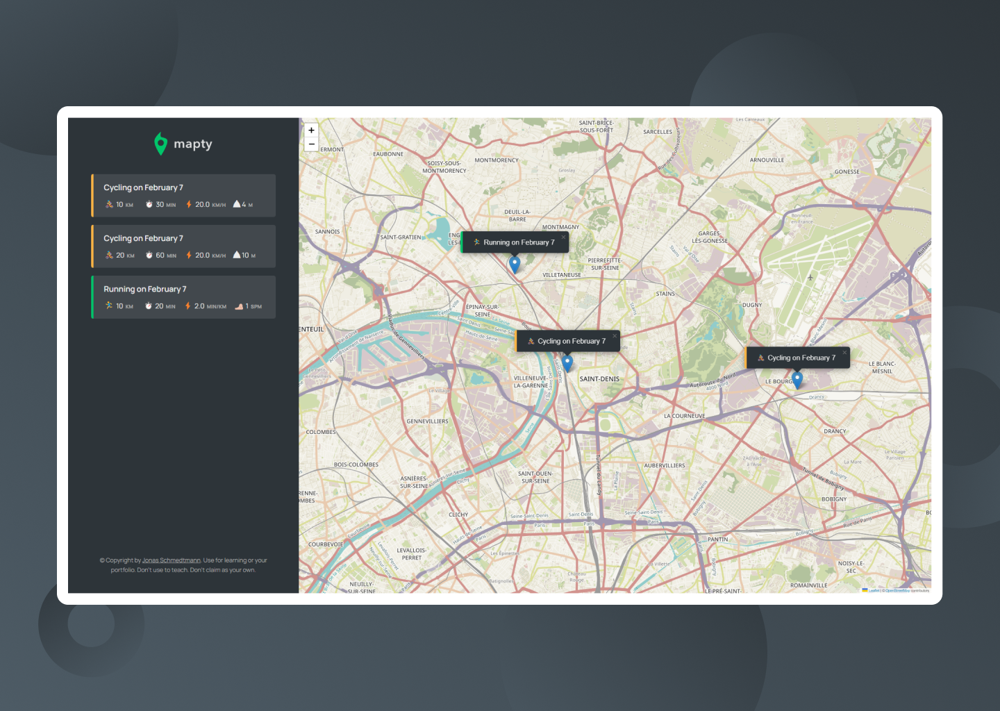

  

    <h1>Mapty</h1>
     
    
An app to schedule your cycling and running time on the map

    <h3><a href="https://gameon-cem.netlify.app/">🔗 Link to the Website</a></h2>
    
  

## Built with

## Features

- Geolocation built-in API & Leaflet API
- Simple and Minimalist Interface

## Context of the Project

This is a part of a JavaScript course that i've completed on Udemy
